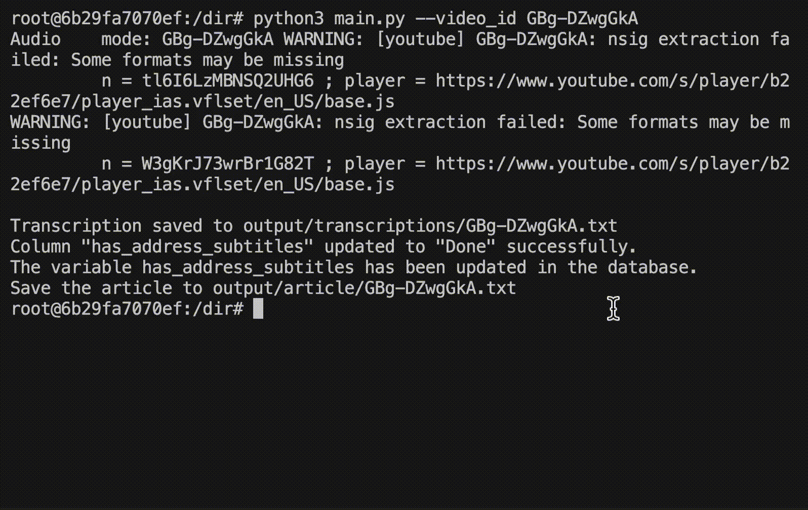

# SubToArticle: 
[中文閱讀](docs/README_ZH.md)

## What is SubToArticle?
SubToArticle is a tool that converts subtitles into articles. It allows you to easily transform YouTube video subtitles into well-structured articles in just a few steps.

## How to use it in three steps？
### Step 1: Copy the YouTube video ID you are interested in.


### Step 2: Generate your article using the script.


### Step 3: Check the generated article.


## Features

- Fetch video IDs from YouTube playlists
- Download subtitles from YouTube videos or transcribe audio using `Whisper`.
- Generate articles from video subtitles using `ChatGPT`.
- Flexible operation modes for full process or individual steps

## Setup
## Prerequisites

- Python 3.7 or higher
- Required Python packages:
  - `openai`
  - `yt-dlp`
  - `CopyCraftAPI` (install from GitHub)
- `ffmpeg`
- `sqlite3`

## Installation
1. Pull a docker image from docker hub:

   ```bash
    docker pull benjiminhsu/subtoarticle:1.0.6
   ```

2. Run a docker image as a container
    ```sh
    docker run -it --env OPENAI_API_KEY=<your_api_key> subtoarticle:1.0.6 bash

    ```
## Usage
Generate Article for a Single Video

```sh
python main.py --video_id <VIDEO_ID>
```
--subtitle_source: Source of Subtitles for Article Generation

* **mp3 (default)**: Subtitles are generated from the MP3 file using Whisper, providing more stable content.
* **subtitle**: Uses subtitles provided by the video, which could be either manually uploaded or automatically generated by the system. Not all videos have subtitles, and the quality of auto-generated subtitles may vary. Suitable for generating a large number of articles.
* **both**: Prioritizes the subtitle mode, falling back to mp3 mode if no subtitles are available.
```sh
python main.py --video_id <VIDEO_ID> --subtitle_source subtitle
```

--mode: Main Mode of Execution for main.py
* **full_process (default)**: Executes the entire process including fetching video information, downloading subtitles, and generating articles.
* **fetch_video_id**: Fetches video IDs, used for batch downloading information.
```sh
python main.py --download_mode playlist --channel_url @BenHsu501
```
* **download_subtitle**: Downloads subtitles. If using --download_mode playlist, it is recommended to use --subtitle_source subtitle to avoid long Whisper processing times.

```sh
python main.py --download_mode playlist `--subtitle_source subtitle --channel_url @BenHsu501
```
* **generate_article**: Generates an article.
python main.py --download_mode video_id --video_id <VIDEO_ID> --model gpt-4o

