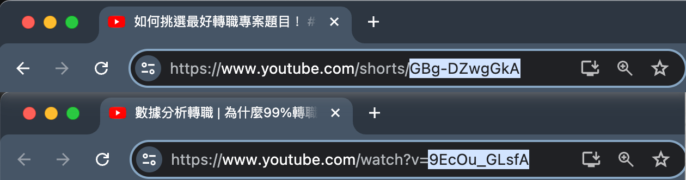

# SubToArticle
[中文閱讀](docs/README_ZH.md)
## How to use it in two steps？
### Step 1: Copy the youtube video ID you are interested in.

### Step 2: Get your article via script


## Introduction
Do you often bookmark countless video links only to never open them again? Are these videos too lengthy, making it difficult to find time to watch? These deterrents can cause you to miss out on crucial information. In this project, you can batch download subtitles from specific YouTubers and generate articles from them, allowing you to quickly absorb information. This way, you can stay informed without spending hours watching videos.
## Features

- Fetch video IDs from YouTube playlists
- Download subtitles from YouTube videos
- Generate articles from video subtitles using OpenAI's API
- Flexible operation modes for full process or individual steps


## Prerequisites

- Python 3.7 or higher
- Required Python packages: `openai`, `yt-dlp`, `CopyCraftAPI`

## Installation
### Local install
1. Clone the repository:

   ```bash
   git clone https://github.com/BenHsu501/SubToArticle.git
   cd SubToArticle
   ```

2. Install dependencies:
    ```sh
    pip install -r requirements.txt
    pip install git+https://github.com/BenHsu501/CopyCraftAPI.git
    ```

3. Install sqlite and ffmpeg
    ```sh
    apt-get update && apt-get install -y sqlite3 ffmpeg
    ```

### Build docker image

1. Clone the repository:

   ```bash
   git clone https://github.com/BenHsu501/SubToArticle.git
   cd SubToArticle
   ```

2. Build docker image
    ```
    docker build -t  subtoarticle . --no-cache
    ```

```
docker run -it --env OPENAI_API_KEY=<your_api_key> --name app subtoarticle:1.0.0 bash
```

## Usage

### Command-Line Interface